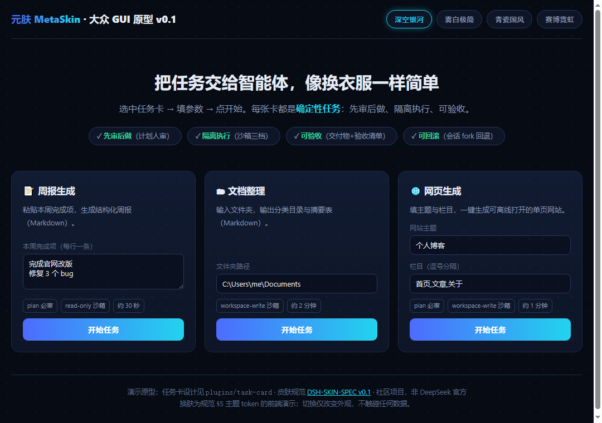
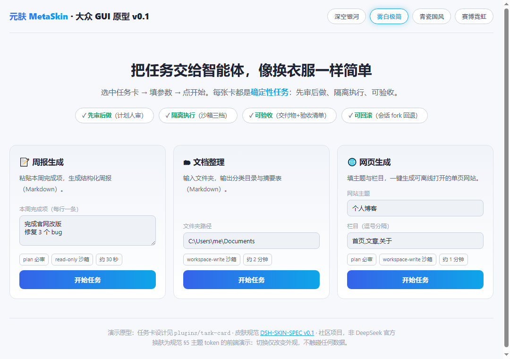
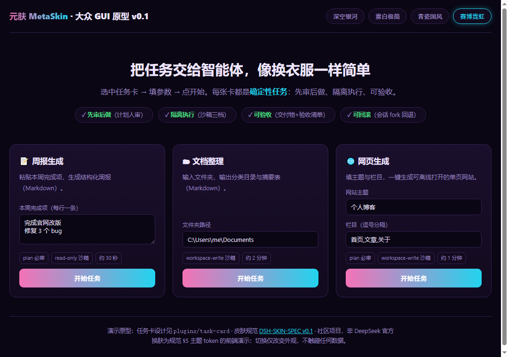
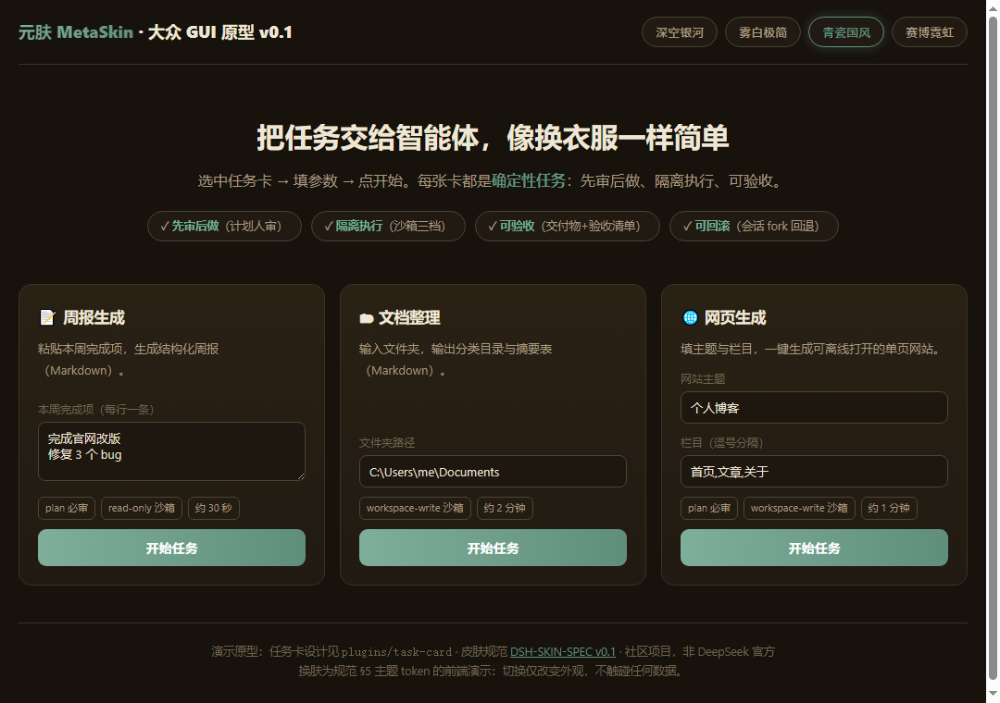

# DeepSeek Skin Studio · DeepSeek Harness 换肤工作室

<div align="center">

**给 DeepSeek Harness 换一张会呼吸的脸。**

一张图，一种心情 · 三通道注入（书签 / CDP / 原生插件） · 不修改官方安装包 · 全平台

*Reskin DeepSeek Harness Web UI (127.0.0.1:3080) with one image. Three injection channels: bookmarklet / CDP / native DSH plugin.*

[](LICENSE)


[快速开始](#快速开始) · [可视化工坊](studio/index.html) · [主题提示词库](docs/theme-prompts.md) · [完整手册](docs/manual.md) · [晒图区](https://github.com/MetaSkin/deepseek-skin-studio/discussions) · [English](README.en.md)

</div>

> ## 🆕 为什么是现在
>
> DeepSeek Harness 是 GitHub 史上最快涨星项目（约 1.5 小时破 2.2 万星），插件生态正在「宇宙大爆炸」。**DeepSeek-Skin-Studio 是 DSH 生态第一个换肤工作室**：抢在品类定义期，把「一张图 = 一套皮肤」带给 DSH 用户。

## 需求证据：内测用户已经投了票

DSH 官方发布时展示了内测用户作品，美学经济在 DSH 生态已被真实验证：

- **`@linxin666/dsh-pet`（npm，v0.1.11）**：内测用户做的「鲸鱼娘宠物插件」——会随模型状态反应（idle/waiting/thinking/tool/done）的治愈系陪伴宠物，含抚摸/喂食互动与好感度系统。**「鲸鱼娘」已成为 DSH 社区视觉 IP**。
- **DreamSkin.cc 社区已出现「DeepSeek-鲸鱼娘」主题**（by powerdog996）——同一 IP 在换肤市场也被验证有需求。
- **100+ 社区插件被媒体盘点**（「有人给 V4 装眼睛，有人把余额做成血条」）——个性化是 DSH 早期插件供给的第一动力。

结论：<strong>皮肤 + 宠物 = DSH 美学经济的两大品类</strong>。本仓库先卡位皮肤；宠物线（dsh-pet 兼容/收录）列入 v0.3 路线图。

## 它长这样

| 深空银河（暗色） | 雾白极简（浅色） |
| --- | --- |
|  |  |

| 赛博霓虹 | 青瓷国风 |
| --- | --- |
|  |  |

## 这是什么

一个给 DeepSeek Harness **Web UI 换肤**的工具。与给 Electron 桌面端（Codex / WorkBuddy）换肤的同类项目不同，DSH 是跑在浏览器里的本地 Web 应用，因此我们提供**三条注入通道**，按需选择：

- **① 书签 / 控制台片段（零依赖，最快）**：`node src/cli.mjs snippet --theme galaxy-deep` 输出一段代码，粘贴到浏览器地址栏（书签）或控制台，即刻换肤；刷新后重粘一次即可。
- **② CDP 一键注入（推荐）**：以远程调试模式启动浏览器，`node src/cli.mjs apply --theme galaxy-deep` 自动发现 DSH 标签页并注入 CSS + 🎨 主题中心菜单，菜单内即点即换、随时「原生界面」一键还原。
- **③ 原生 DSH 插件（规范路线，卡位事实标准）**：`node src/cli.mjs export-spec --theme galaxy-deep` 按 [DSH-SKIN-SPEC v0.1](../dsh-skin-lab/spec/DSH-SKIN-SPEC-v0.1.md) 导出标准皮肤包（manifest + theme.css），配合 `skin-loader` 插件实现卸载即还原的可逆换肤。

**一张图片就是一套主题**：在[可视化工坊](studio/index.html)上传任意 PNG / JPG / JPEG / WebP，自动取色（主色 / 辅色 / 面板底色 / 文字色）并生成完整皮肤，实时预览、深浅自动适配。

## 快速开始

需要 Node.js 22+（仅 CLI 需要；书签与工坊纯浏览器）。已运行 DeepSeek Harness Web UI（默认 `http://127.0.0.1:3080`）。

### 用 AI 一键安装（推荐）

把本仓库地址发给任意 AI 助手，说一句：

> 用这个开源项目帮我给 DeepSeek Harness 换主题

AI 会读根目录 [`SKILL.md`](SKILL.md)，自动完成**平台检测 → 启动调试浏览器 → 注入主题 → 验证状态**。

### 手动（CDP 通道）

```bash
# macOS / Linux：以调试模式打开浏览器并注入
./scripts/apply.command --theme galaxy-deep

# Windows PowerShell
.\scripts\apply.ps1 -Theme galaxy-deep

# 或纯 CLI
node src/cli.mjs doctor                     # 环境自检
node src/cli.mjs apply --theme galaxy-deep  # 注入（默认调试端口 9331）
node src/cli.mjs status                     # 查询注入状态
node src/cli.mjs pause                      # 恢复原生
```

### 书签通道（零依赖）

```bash
node src/cli.mjs snippet --theme cyber-neon
# 复制输出的代码 → 浏览器新建书签（地址粘贴该代码）→ 打开 DSH 页面点击书签
```

## 可视化工坊（Studio）

双击 `studio/index.html`（离线可用）：

- 左侧：12 套内置主题 + 上传图片自动取色
- 中间：DSH 风格界面实时预览（侧栏 / 会话 / 卡片）
- 右侧：主色 / 辅色 / 面板 / 文字调色，深浅自动判定
- 顶部：一键导出 `theme.json` / `theme.css`（DSH-SKIN-SPEC）/ 注入片段

## 极简主题格式（themes/*.json）

```json
{
  "schemaVersion": 1,
  "id": "galaxy-deep",
  "name": "深空银河 Galaxy",
  "hero": "galaxy-deep.png",
  "colors": {
    "accent": "#4d6bfe",
    "secondary": "#22d3ee",
    "accent3": "#a78bfa",
    "surface": "#0d1526",
    "panel": "#111b31",
    "bg": "#070b14",
    "border": "#1d2a45",
    "text": "#e6ebf5",
    "muted": "#8b98b3",
    "ok": "#34d399",
    "warn": "#fbbf24",
    "danger": "#f87171"
  }
}
```

仅 `schemaVersion`、`id`、`name` 必填。`hero` 图片位于主题目录内；`colors` 可省略（自动取色或默认值）。`surface` 明度决定深/浅模式（亮度 > 140 为浅色）。

## 内置 13 套主题

| id | 名称 | 风格 |
|---|---|---|
| `galaxy-deep` | 深空银河 | 蓝紫 · 暗色 |
| `mist-minimal` | 雾白极简 | 蓝 · 浅色 |
| `celadon-ink` | 青瓷国风 | 青瓷 · 暗色 |
| `aurora-borealis` | 极光 | 绿紫 · 暗色 |
| `cyber-neon` | 赛博霓虹 | 品红青 · 暗色 |
| `sunset-dunes` | 落日余晖 | 琥珀 · 浅色 |
| `forest-mist` | 森林晨雾 | 绿 · 浅色 |
| `ocean-abyss` | 深海 | 蓝 · 暗色 |
| `sakura-breeze` | 樱花 | 粉 · 浅色 |
| `night-knight` | 暗夜骑士 | 黑白红 · 暗色 |
| `vaporwave` | 蒸汽波 | 粉青 · 暗色 |
| `panda-classic` | 熊猫经典 | 黑白绿 · 浅色 |
| `whale-girl` | 鲸鱼娘 | 深海蓝 · 暗色 · 治愈系 |

## 命令行

```bash
node src/cli.mjs list                                # 列出全部主题
node src/cli.mjs create --name X --hero p.png --colors '{"accent":"#4d6bfe",...}'  # 创建主题
node src/cli.mjs apply [--theme ID] [--port 9331] [--url http://127.0.0.1:3080]    # CDP 注入
node src/cli.mjs status                              # 注入状态
node src/cli.mjs pause                               # 恢复原生
node src/cli.mjs doctor                              # 环境自检（Node/DSH/端口）
node src/cli.mjs snippet --theme ID                  # 书签/控制台片段
node src/cli.mjs export-spec --theme ID --out dir    # 导出 DSH-SKIN-SPEC 皮肤包
```

## 设计边界（三点实话）

- 本工具是社区项目，非 DeepSeek 官方；只注入样式与主题菜单，**不修改** DSH 安装目录、配置与代码签名。
- CDP 只绑定本机回环地址 `127.0.0.1`；主题运行期间勿跑来源不明的本机程序。
- 浏览器通道的注入随刷新消失（书签/控制台的天性），重粘一次即可；原生插件通道（③）可实现持久化与卸载即还原。

## 技术原理

1. DSH Web UI 是本地 Web 应用（默认 `127.0.0.1:3080`），运行于浏览器。
2. **CDP 通道**：以 `--remote-debugging-port=9331` 启动 Chrome/Edge → `GET /json/list` 发现 DSH 标签页 → WebSocket `Runtime.evaluate` 注入 `<style>`（覆盖 `--dsh-*` 主题 token + 背景底图）与 🎨 主题菜单 DOM。
3. **书签通道**：同一注入载荷压缩为书签代码，粘贴即用。
4. **原生通道**：`export-spec` 生成符合 [DSH-SKIN-SPEC v0.1](../dsh-skin-lab/spec/DSH-SKIN-SPEC-v0.1.md) 的皮肤包，由 `skin-loader` client 插件装载——卸载即恢复默认（可逆效果）。

## 路线图（对照 DreamSkin.cc 成熟形态）

| 版本 | 内容 |
|---|---|
| [x] v0.1 | 12 套内置主题 + 三通道注入 + 可视化工坊 + export-spec |
| [ ] v0.2 | **客户端 App 化**（安装包 + 托盘/菜单栏常驻，无需 Node）；**主题库 Gallery**（审核 + 热门/最新排序 + 创作者榜单 + 网页试穿模拟器）；**一键换肤**（`dshskin://` URL scheme + SHA-256 校验 + 失败自动回滚）——对照 [DreamSkin.cc](https://dreamskin.cc) 已验证的形态 |
| [ ] v0.3 | **在线 Studio 投稿审核**（登录 + 人工审核 + Safe CSS 契约）；**宠物插件线**（dsh-pet 兼容/收录，鲸鱼娘 IP 联动）；赞助模型（API 中转等开发者赞助，参照 Codex-Dream-Skin 的 Passion8 案例） |

## 致谢

本项目参考了三个优秀的换肤项目：

- [Fei-Away/Codex-Dream-Skin](https://github.com/Fei-Away/Codex-Dream-Skin) — 最成熟的形态参照：客户端 App + [DreamSkin.cc](https://dreamskin.cc) 主题库/在线 Studio + 一键换肤协议 + 审核与安全校验 + 赞助模型
- [HeiGeAi/heige-codex-skin-studio](https://github.com/HeiGeAi/heige-codex-skin-studio) — CDP 注入架构、主题中心菜单、取色逻辑
- [cdredfox/workbuddy-skin-studio](https://github.com/cdredfox/workbuddy-skin-studio) — 极简主题 schema、CLI 与 SKILL.md 范式

## 许可

[MIT](LICENSE)。内置主题素材为纯代码绘制（CSS/SVG），无第三方版权素材；社区投稿主题的素材权利由投稿者声明，参照 DreamSkin 的审核实践（权利存疑素材不进公开安装包）。
